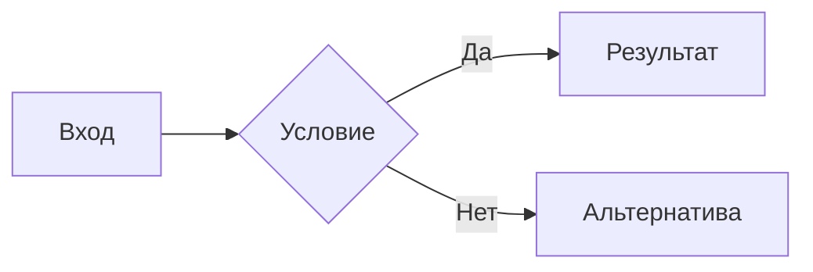

# PRD

Сжатый PRD из 6 разделов. Его читают на планировании, а не изучают неделю.

## Главное правило

**Документ читается за 2-3 минуты и не требует встречи, чтобы понять, что делать.** Всё, что не влияет на решение разработчика или дизайнера, выкидывается.

Жёсткие ограничения объёма:

| Параметр | Норма |
|---|---|
| Весь документ | ≤ 600 слов, 1-2 страницы A4 |
| Один раздел | ≤ 120 слов |
| User stories | 1-3 штуки |
| Use cases | 2-5 штук |
| Пункты «как должно быть» | 5-12 |
| Критерии приёмки | 4-8 |

Таблицы раздела «Аналитика» в лимит слов не входят.

Запрещено: маркетинговый тон, повтор одной мысли в разных разделах, описание архитектуры и схемы БД, «TBD» россыпью по тексту, длинные списки хотелок без приоритета.

Пиши на языке пользователя. Термины, имена API, поля, коды ошибок и названия экранов - как есть, без перевода.

## Процесс

### 1. Собрать вход

Прочитай, что уже дал пользователь: описание, тикет, ссылку, файл, скриншот, код. Если в проекте есть релевантный код или экраны - посмотри их, это снимает половину вопросов.

Дальше проверь, как фича работает сейчас, своими руками - см. «Preprod» и «Внешние системы» ниже. Требования пишутся по наблюдаемому поведению, а не по догадкам: реальные названия экранов, кнопок, полей, статусов, тарифов и текстов ошибок.

### 2. Задать до 3 вопросов (только если без них PRD будет бесполезным)

Одним разом через `AskUserQuestion`. Приоритет:

1. **Кто пользователь и какую задачу решает** - если из входа не ясно.
2. **Что именно меняем в поведении** - если «как должно быть» иначе придётся выдумывать.
3. **По чему поймём, что готово** - если нет ни метрики, ни проверяемого условия.

Не спрашивай то, на что ответ уже есть во входе, вкусовщину и детали реализации. Если данных хватает - вопросы не задавай, сразу пиши.

Пробелы не переспрашивай второй раз: помечай прямо в тексте как `Допущение: <...>`.

### 3. Написать по шаблону

6 разделов, порядок фиксированный. Что важно в каждом:

1. **User story / use cases** - user story в формате «Как <роль>, я хочу <действие>, чтобы <результат>». Use case - конкретная ситуация с триггером и результатом, а не пересказ той же story другими словами.
2. **Контекст** - как устроено сейчас, где болит, 1-3 цифры или факта. Только то, что объясняет, почему меняем. Не история продукта.
3. **Как должно быть** - нумерованные пункты целевого поведения, каждый проверяемый: не «удобный поиск», а «поиск ищет по VIN и госномеру, результат за ≤ 300 мс». Если меняется путь пользователя - добавь подраздел «Новый user flow» нумерованными шагами от входа до результата. Если путь не меняется - подраздел не пиши. Отдельной строкой: **Не входит в скоуп**, 2-4 пункта.
4. **Визуализация** - обязательный раздел, см. ниже.
5. **Аналитика** - обязательный раздел, см. ниже.
6. **Критерии приёмки** - список в формате «дано - действие - ожидаемый результат» или таблица «проверка - ожидаемое». Каждый пункт наблюдаемый: по нему тестировщик закрывает задачу без разговоров.

### 4. Визуализация

Раздел обязателен - именно он экономит абзацы текста. Выбор типа:

| Что описываем | Что рисуем |
|---|---|
| Последовательность шагов, ветвления | `flowchart` (mermaid) |
| Взаимодействие пользователь / система / внешний сервис | `sequenceDiagram` (mermaid) |
| Смена статусов сущности (заказ, объявление, заявка) | `stateDiagram-v2` (mermaid) |
| Изменение экрана или новый экран | мокап - ASCII-раскладка блоков или HTML-артефакт |
| Изменение структуры данных | таблица «поле - тип - что меняется» |

Правила: одна картинка на PRD, максимум две. Mermaid вставляй блоком ```` ```mermaid ```` - он рендерится и в Artifacts, и в большинстве вьюеров. Подписи узлов - на языке документа, короткие. Если рисовать нечего - напиши одну строку «Визуализация не нужна: <причина>», но сначала честно проверь, что нечего.

### 5. Аналитика

Раздел - ровно две таблицы, других форматов нет.

**Таблица 1. События:** `Событие | Определение события | Триггер | Параметры`
**Таблица 2. Параметры:** `Параметр | Определение параметра | Обязательный | Значения`

Правила:
- События - в порядке воронки, от входа до результата.
- Имя события - `объект_действие` в прошедшем времени, `snake_case` латиницей. Если в проекте есть tracking plan или спека разметки - сверь имена событий и параметров с ней, существующие не переименовывай.
- Определение события - что оно значит для продукта, одним предложением. Триггер - точный момент срабатывания, кто шлёт («Клиент: ...» / «Бэкенд: ...») и правило дедупликации, если нужно («Один раз на `order_id`»).
- В таблице 1 параметры - только имена через запятую. Определение, тип и значения - только в таблице 2. Каждый параметр из таблицы 1 есть в таблице 2, лишних строк нет.
- Обязательный - «Да» или «Нет».
- Значения - тип (`string`, `integer`, `boolean`) и единицы или перечень enum-значений латиницей. Деньги - целым числом, валюта отдельным параметром.
- Параметры-разрезы (источник входа, тип сценария) передавай во все следующие события цепочки.
- Телефон, email, ФИО, VIN, госномер не передаются - только внутренний ID или хэш.
- В разделе 3 события не перечисляй, дай ссылку на раздел 5. В критерии приёмки добавь одну проверку разметки: действие - какие события пришли и с какими значениями.
- Если размечать нечего - одна строка «Аналитика не нужна: <причина>».

### 6. Отдать результат

Сохрани markdown-файл: `<Короткое-имя-фичи>.md` (без префикса PRD_), рядом с проектом или в указанную пользователем директорию, иначе в scratchpad. Отправь через `SendUserFile`.

В ответе - 3-4 строки: суть фичи, число пунктов «как должно быть», допущения и открытые вопросы, если есть. Документ целиком не пересказывай.

Дополнительно, только если пользователь попросит:
- **HTML-страница** для шаринга - опубликуй артефакт (mermaid рендерится нативно).
- **`.docx`** - `node <путь к скиллу>/scripts/md2docx.js <файл.md> <файл.docx>`. Скрипт без зависимостей, нужен только Node.js. Блоки кода он не поддерживает: перед конвертацией замени mermaid-блок на нумерованный список шагов, иначе диаграмма пропадёт.

## Внешние системы - только через Comet

Redash, Figma, Jira, Confluence открывай сразу в браузере Comet через расширение Claude in Chrome (инструменты `mcp__claude-in-chrome__*`). Не встроенный браузер `mcp__Claude_Browser__*`, не облачные коннекторы Atlassian/Figma - корпоративные Jira и Confluence self-hosted, пользователь залогинен именно в Comet.

1. Загрузи инструменты одним `ToolSearch`: `select:mcp__claude-in-chrome__tabs_context_mcp,mcp__claude-in-chrome__navigate,mcp__claude-in-chrome__computer,mcp__claude-in-chrome__read_page,mcp__claude-in-chrome__get_page_text,mcp__claude-in-chrome__javascript_tool,mcp__claude-in-chrome__tabs_create_mcp,mcp__claude-in-chrome__list_connected_browsers,mcp__claude-in-chrome__select_browser`.
2. `list_connected_browsers` - если подключено несколько, `select_browser` на Comet.
3. Данные бери через `fetch` к REST API из вкладки нужного домена (сессия уже есть), а не кликами:
   - Jira `jira.mashina.kg` и Confluence `confluence.mdigital.kg` - Server REST, на запись заголовок `X-Atlassian-Token: no-check`.
   - Redash `http://92.204.189.31:8082` - `/api/queries/<id>`, `/api/query_results`.
   - Figma - открой ссылку на макет, смотри скриншотом и `get_page_text`.
4. Ограничения `javascript_tool`: таймаут 45 с - не больше 3-4 запросов на запись за вызов; вывод режется ~1000 символов - большой результат выводи в `<pre>` на странице и читай `get_page_text`. После таймаута сначала проверь состояние на сервере, потом повторяй - иначе дубли.

## Preprod

`https://preprod.mashina.kg/` - тестовая среда, созданная для экспериментов. Открывай её в Comet и проверяй всё, что касается фичи: подать, отредактировать, поднять, удалить объявление, купить тариф или услугу, оформить кредитную заявку, пройти платный сценарий до конца. Тестовые данные можно создавать и удалять без согласования - это не прод.

Зачем: снять текущий user flow по шагам, точные тексты экранов и ошибок, граничные случаи (пустое состояние, отказ, повтор) и сетевые запросы (`read_network_requests` - какие эндпоинты и поля уже есть). Всё найденное идёт в «Контекст», «Как должно быть» и критерии приёмки.

Границы, которые не снимаются даже на preprod: реквизиты банковских карт, пароли и коды из SMS в поля не вводишь сам - если сценарий упёрся в них, попроси пользователя пройти этот шаг и продолжай после. Прод-домен `mashina.kg` не трогай ничем, кроме чтения.

## «Грузи» - публикация в Confluence

Команда «грузи» = опубликовать текущий PRD в Confluence. Согласование не нужно, команда и есть согласие.

1. Открой в Comet `https://confluence.mdigital.kg/pages/viewpage.action?pageId=59409127`. Найди раздел «Продуктовая документация» (это сама страница или её потомок) и возьми его дерево: `GET /rest/api/content/<id>/child/page?limit=200&expand=children.page`.
2. Выбери подходящую папку по теме фичи (продукт, модуль: кредиты, тарифы, объявления, аналитика и т. п.). Если подходят две или ни одна - одним вопросом `AskUserQuestion` дай 2-3 варианта с рекомендованным первым.
3. Проверь, что страницы с таким заголовком ещё нет: `GET /rest/api/content?spaceKey=<key>&title=<название>`. Если есть - не создавай дубль, спроси: обновить её или создать с другим названием.
4. Строки шапки `**Дата:** ... · **Статус:** ...` и `**Confluence:**` в Confluence не переноси, они остаются только в `.md`. Переведи markdown в storage format: заголовки `h2`, списки `ol/ul`, таблицы `table` с `th`, код и имена событий - `<code>`. Диаграмму вставь тем макросом, который уже используется на соседних страницах раздела (посмотри storage 1-2 страниц: `mermaid`, `drawio`, `plantuml`). Если такого нет - блок `code` с mermaid-текстом и под ним нумерованный список шагов, чтобы схема читалась без рендера.
5. Создай страницу: `POST /rest/api/content` с `{type:'page', title, space:{key}, ancestors:[{id:<папка>}], body:{storage:{value, representation:'storage'}}}`. Заголовок - только название фичи, без «PRD».
6. Открой созданную страницу и проверь глазами (скриншот): таблицы, диаграмма, кириллица. В ответе - ссылка на страницу и в какую папку положил.
7. Запиши ссылку и `pageId` в шапку локального `.md` (`**Confluence:** <url>`), чтобы следующие команды работали с той же страницей.

## «Обнови с учётом комментов» - разбор комментариев Confluence

Страница - та, что опубликована в этой сессии, записана в шапке `.md` или дана ссылкой. Если непонятно, какая - спроси.

1. Собери все комментарии: `GET /rest/api/content/<id>/child/comment?depth=all&limit=200&expand=body.storage,extensions.inlineProperties,extensions.resolution,version,history`. Нижние - `extensions.location = footer`; inline - `location = inline`, выделенный текст в `extensions.inlineProperties.originalSelection`, привязка к месту в тексте - `<ac:inline-comment-marker ac:ref="...">` в storage страницы.
2. Отдельно найди в storage страницы текст, подсвеченный жёлтым вручную (`<span style="background-color: ...">` с жёлтым оттенком, `highlight`) - это тоже вопросы к месту, даже без комментария.
3. Пропусти resolved-комментарии. Треды читай целиком - ответ может уже быть в реплике ниже.
4. По каждому пункту продумай ответ: что спросили или предложили, прав ли автор, что меняем в документе. Факты проверяй - на preprod, в Redash, Jira, коде, а не из головы. Если ответа нет и его может дать только пользователь или команда - не выдумывай, вынеси в открытые вопросы.
5. Отредактируй локальный `.md`. Страницу в Confluence не трогай, пока пользователь прямо не скажет обновить её («грузи», «обнови в Confluence», «залей на страницу»). Сама команда «обнови с учётом комментов» и доработки документа в следующих сообщениях - это правка только `.md`. В ответе напиши, что Confluence не обновлён, и жди команды. Когда команда есть: `GET /rest/api/content/<id>?expand=body.storage,version`, правки в storage, `PUT` с `version.number + 1` и `version.message` «Правки по комментариям». Правь точечно: маркеры `ac:inline-comment-marker` на неизменённом тексте сохраняй, иначе комментарии оторвутся от места. Ручную жёлтую подсветку снимай только там, где вопрос закрыт правкой. Лимиты объёма из «Главного правила» действуют и после правок.
6. На комментарии в Confluence не отвечай и не резолви их, пока пользователь не попросит - это сообщения от его имени.
7. В ответе - таблица `Комментарий (автор, цитата) | Ответ | Что изменил в документе`, плюс открытые вопросы. Ссылка на обновлённую страницу - только если её обновляли по прямой команде.

## Шаблон

````markdown
# <Название фичи>

**Дата:** <YYYY-MM-DD> · **Статус:** Draft

## 1. User story и use cases

**User story.** Как <роль>, я хочу <действие>, чтобы <результат>.

**Use cases.**
1. <Триггер> - <что делает пользователь> - <что получает>.

## 2. Контекст

<Как сейчас, где болит, 1-3 цифры. 3-5 строк, не больше.>

## 3. Как должно быть

1. <Проверяемое утверждение о целевом поведении.>
2. <...>

**Новый user flow** (если путь меняется)
1. <Шаг> - <что видит пользователь>.

**Не входит в скоуп:** <2-4 пункта.>

## 4. Визуализация



## 5. Аналитика

**События**

| Событие | Определение события | Триггер | Параметры |
|---|---|---|---|
| `<object_action_past>` | <что значит для продукта> | <Клиент/Бэкенд: момент срабатывания, дедупликация> | `<param_1>`, `<param_2>` |

**Параметры**

| Параметр | Определение параметра | Обязательный | Значения |
|---|---|---|---|
| `<param_1>` | <что содержит> | Да | <тип, единицы или enum> |

## 6. Критерии приёмки

| # | Проверка | Ожидаемый результат |
|---|---|---|
| 1 | <дано и действие> | <наблюдаемый результат> |
````

Заголовок документа - только название фичи, без префиксов «PRD», «PRD:», «ТЗ» и подобных. То же при публикации в Confluence, Notion и другие системы.

Разделы 1, 3, 4, 5 и 6 держи всегда. Контекст сокращай первым, если документ вылезает за объём.
